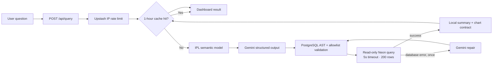
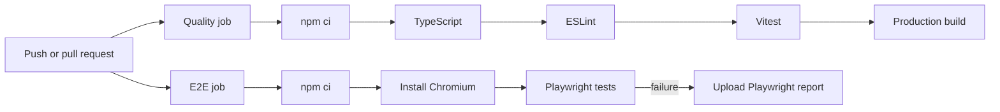

# QueryPilot AI — Natural Language Data Analyst

QueryPilot AI is a public, login-free NLP-to-SQL portfolio application for exploring IPL cricket data. A visitor asks a question in ordinary English; Gemini proposes one PostgreSQL query, the server parses and validates it, a read-only Neon role executes it, and the dashboard presents a local factual summary, table, chart, SQL, and CSV download.

## Architecture



The browser never receives database, Gemini, or Upstash credentials. There is no separate API service: all server behavior lives in Next.js App Router Route Handlers.

## Features

- Strict structured Gemini output with `GEMINI_MODEL` configuration and temperature `0.1`
- Dataset-driven CSV configuration and semantic modelling
- UTF-8 ball data plus CP1252 player-name normalization to UTF-8
- PostgreSQL AST validation, table allowlisting, forbidden-operation checks, single-statement enforcement, and a hard 200-row result cap
- Neon read-only database role and five-second statement timeout
- Upstash fixed-window rate limiting (10 questions/IP/24 hours) and one-hour public IPL cache
- Responsive accessible dashboard with light, dark, and system themes
- Six-step request progress experience, friendly retry states, keyboard submission, and duplicate-request prevention
- Responsive Recharts visualisation, sticky result tables, and CSV export
- Syntax-highlighted PostgreSQL viewer with copy and expand/collapse controls; SQL remains available for cached answers
- Device-local query history with timestamps and rerun/clear controls, plus an environment-configurable per-IP question limit (default 10)
- Vitest, Playwright, verified IPL facts, GitHub Actions, and Vercel-ready configuration

## Quick start

Requirements: Node.js 22+, npm, a Neon PostgreSQL project, a Gemini API key, and optionally Upstash Redis.

```bash
npm install
cp .env.example .env.local
npm run dev
```

Open `http://localhost:3000`. Configure the database and import data before asking live questions. See [docs/SETUP.md](docs/SETUP.md).

## Dataset inputs

Place these files in `data/source/` (they are ignored by Git):

- `BALL_BY_BALL.csv` — UTF-8
- `IPL_MATCH.csv`
- `PLAYER_INFO.csv` — Windows-1252/CP1252
- `TEAMS.csv`
- the original IPL semantic YAML, retained as source documentation

The runnable semantic contract is `config/semantic/ipl.json`. Header aliases live in `config/datasets/ipl.json`; update those aliases if the supplied CSV headers differ. The importer reports missing required headers rather than silently creating bad rows.

```bash
npm run data:import
```

Import is explicit and is never part of `npm run build` or a Vercel build. It inserts in transport-safe batches of up to 1,000 rows and uses `ON CONFLICT DO NOTHING`, so reruns are idempotent.

The supplied source has one known cross-file identifier mismatch: delivery match ID `1473495` has no identical parent ID in `IPL_MATCH.csv`. Migration `003_drop_unreliable_ball_match_fk.sql` therefore removes that unreliable foreign key while preserving the delivery primary key, source value, and join indexes.

## Example questions

- Who hit the most sixes?
- Who took the most wickets?
- Which team won the most matches?
- Compare Virat Kohli and MS Dhoni.
- Which venues hosted the most matches?

Verified expectations for the supplied dataset:

- Most sixes: **CH Gayle — 359**
- Most bowler wickets, excluding run out, retired hurt, retired out, and obstructing the field: **YS Chahal — 221**

## Commands

| Command | Purpose |
|---|---|
| `npm run dev` | Start local Next.js development |
| `npm run data:import` | Import the configured IPL CSV files |
| `npm run typecheck` | Run strict TypeScript checks |
| `npm run lint` | Run ESLint |
| `npm test` | Run Vitest unit and contract tests |
| `npm run test:e2e` | Run Playwright browser tests |
| `npm run build` | Create the production build |

## Quality assurance

QueryPilot includes both developer-level quality checks and automated QA flows.

### Unit and security tests

Vitest checks:

- question validation and malicious-input rejection
- semantic-model loading and verified IPL facts
- PostgreSQL parser behavior
- SELECT and WITH/SELECT acceptance
- DELETE, DROP, multiple-statement, system-schema, and unknown-table rejection
- 200-row enforcement
- chart configuration validation

Run the suite with:

```bash
npm test
```

### End-to-end UI tests

Playwright runs the application in Chromium with deterministic mock API responses. It does not spend Gemini quota or require production database credentials. The browser suite covers:

- dashboard and mobile layout
- light/dark theme persistence
- example-question selection
- Ctrl/Cmd + Enter submission
- loading progress and duplicate-submit prevention
- successful and cached result rendering
- generated SQL visibility, copy, expand, and collapse
- query-history rerun
- CSV download
- friendly service, malicious-input, and rate-limit errors

Run it locally with:

```bash
npx playwright install chromium
npm run test:e2e
```

### Recommended local quality gate

Before pushing a branch or opening a pull request, run:

```bash
npm run typecheck
npm run lint
npm test
npm run test:e2e
npm run build
```

## DevOps and CI/CD

The repository includes a GitHub Actions workflow at `.github/workflows/ci.yml`. It runs automatically on every push and pull request.



The workflow is continuous integration (CI): it validates that a change is safe to merge. It does not directly deploy the application.

### What to do in GitHub

1. Create a GitHub repository and push this project, including `.github/workflows/ci.yml`.
2. Open the repository's **Actions** tab and confirm the `CI` workflow starts.
3. Fix any failing check before merging changes.
4. In **Settings → Branches**, optionally protect `main` and require both `quality` and `e2e` checks before merging.
5. Do not commit `.env`, CSV files, database passwords, or API keys.

The current CI workflow does not need Neon, Gemini, or Upstash secrets because browser tests use `E2E_MOCK_API=true`, and the production build does not execute live queries. Application secrets are needed only in local `.env` files and the Vercel project environment.

For deployment, connect the GitHub repository to Vercel. Vercel can create preview deployments for pull requests and a production deployment when changes reach the configured production branch. Add the server environment variables in Vercel rather than GitHub unless a future workflow explicitly performs live integration tests or deployment. Set `QUERY_RATE_LIMIT=20` in the Vercel Production environment for the intended public allowance; when it is missing or invalid, the server defaults to 10 questions per IP.

## Security boundary

Model output is untrusted. QueryPilot rejects comments, multiple statements, non-SELECT AST nodes, unknown tables, non-public schemas, system catalogs, file/network helpers, extensions, transactions, and write/DDL commands. Accepted SQL is capped externally at 200 rows before execution. The application connection should use only `CONNECT`, `USAGE`, and `SELECT`, with `default_transaction_read_only=on` and `statement_timeout=5s`. See [SECURITY.md](SECURITY.md).

## Screenshots

> Add final deployed screenshots here:
>
> - Desktop question and result dashboard
> - Mobile dashboard
> - Generated SQL panel

## Portfolio copy

### CV

**QueryPilot AI — Natural Language Data Analyst:** Built a secure, public NLP-to-SQL analytics dashboard using Next.js, TypeScript, Gemini, Neon PostgreSQL, and Upstash. Designed a reusable semantic modelling and CSV ingestion pipeline, AST-based SQL safety controls, read-only execution, caching/rate limiting, Recharts visualisations, and automated Vitest/Playwright CI.

### LinkedIn

I built QueryPilot AI, a production-minded natural-language data analyst for IPL cricket. Users ask ordinary questions and receive evidence-backed tables and charts, while a semantic layer grounds Gemini in the real schema. Every generated PostgreSQL statement is treated as untrusted: it must pass AST validation and table allowlisting before a read-only Neon role can execute it with strict time and row limits. The project also includes encoding-aware, idempotent CSV ingestion; Upstash caching and abuse controls; accessible responsive UI; and full unit, browser, build, and CI coverage.

## License

Portfolio and educational use. Confirm the license of the IPL source dataset before republishing its raw files.
